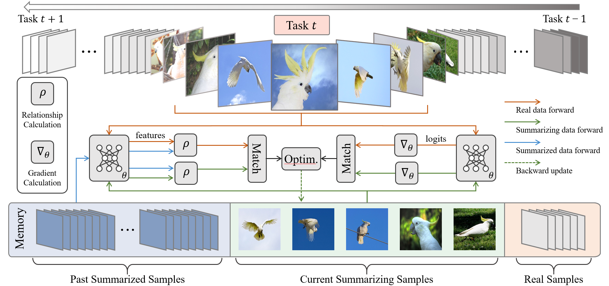

# Summarizing Stream Data for Memory-Restricted Online Continual Learning

Official implementation of "[Summarizing Stream Data for Memory-Restricted Online Continual Learning](https://arxiv.org/abs/2305.16645)"

## Abstract

Replay-based methods have proved their effectiveness on online continual learning by rehearsing past samples from an auxiliary memory. With many efforts made on improving training schemes based on the memory, however, the information carried by each sample in the memory remains under-investigated. Under circumstances with restricted storage space, the informativeness of the memory becomes critical for effective replay. Although some works design specific strategies to select representative samples, by only employing original images, the storage space is still not well utilized. To this end, we propose to Summarize the knowledge from the Stream Data (SSD) into more informative samples by distilling the training characteristics of real images. Through maintaining the consistency of training gradients and relationship to the past tasks, the summarized samples are more representative for the stream data compared to the original images. Extensive experiments are conducted on multiple online continual learning benchmarks to support that the proposed SSD method significantly enhances the replay effects. We demonstrate that with limited extra computational overhead, SSD provides more than 3% accuracy boost for sequential CIFAR-100 under extremely restricted memory buffer.



## Datasets

### Online Class Incremental
- Split CIFAR100
- Split Mini-ImageNet
- Split Tiny-ImageNet

### Data preparation
- CIFAR10 & CIFAR100 will be downloaded during the first run
- Mini-ImageNet: Download from https://www.kaggle.com/whitemoon/miniimagenet/download, and place it in datasets/mini_imagenet/
- Tiny-ImageNet: Download from http://cs231n.stanford.edu/tiny-imagenet-200.zip, place it in datasets/tiny-imagenet-200/, and suppress it into pickles

## Run commands
Detailed descriptions of options can be found in [general_main.py](general_main.py)

### Sample commands to run algorithms on Split-CIFAR100
```shell
python general_main.py --data cifar100 --cl_type nc --agent SSCR --retrieve random --update summarize --mem_size 1000 --images_per_class 10 --head mlp --temp 0.07 --eps_mem_batch 100 --lr_img 4e-3 --summarize_interval 6 --queue_size 64 --mem_weight 1 --num_runs 10
```

## Acknowledgement

This project is mainly based on [online-continual-learning](https://github.com/RaptorMai/online-continual-learning)

## Citation

If you find this work helpful, please cite:
```
@article{gu2023summarizing,
  title={Summarizing Stream Data for Memory-Restricted Online Continual Learning},
  author={Gu, Jianyang and Wang, Kai and Jiang, Wei and You, Yang},
  journal={arXiv preprint arXiv:2305.16645},
  year={2023}
}
```
